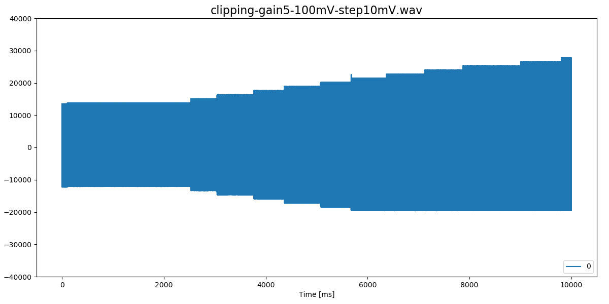
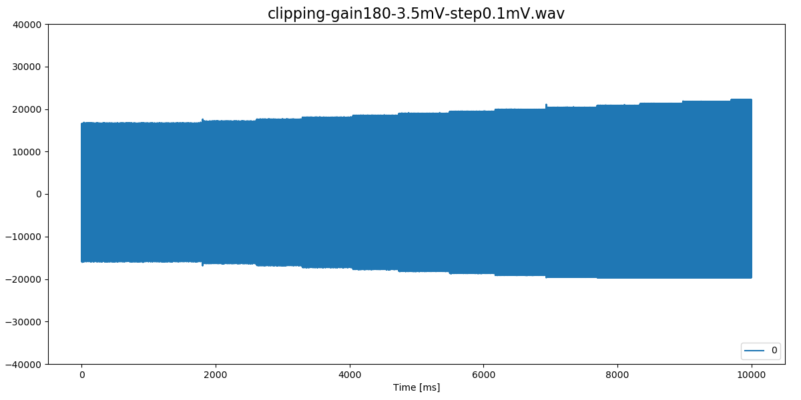
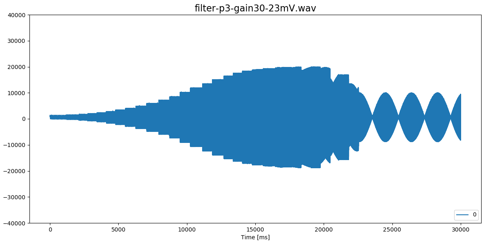

# 8-channel logger

Four of the two-channel amplifiers by Stefan Mucha ([TeensyAmp
R1.0](https://github.com/muchaste/Teensy_Amp)) are connected to a
[Teensy 3.5](https://www.pjrc.com/store/teensy35.html).

Designed by Jan Benda in November 2021.

The four amplifiers are mounted on the bottom side of the base plate:

On the upper side we have the Teensy, the power bank, and the screw
terminals for the 8 inputs and their reference:

## Wiring

Input and output signals are color coded:

- channel 0: white
- channel 1: yellow
- channel 2: orange
- channel 3: red
- channel 4: green
- channel 5: blue
- channel 6: purple
- channel 7: brown

JP3 pin 4 (0V) not connected to AGND or GND.

On Teensy, connecting AGND to GND seems to reduce noise a tiny bit.

## Noise levels

Running with 20 kHz at 12 bit resolution, the [averaging
sketch](https://github.com/janscience/TeeRec/blob/main/examples/averaging/averaging.ino)
of the [TeeRec](https://github.com/janscience/TeeRec) library reports
for the standard deviations of the raw integer readings:

| convers  | sampling | avrg |   A4 |   A2 |   A5 |   A3 |   A6 |  A20 |   A7 |  A22 |
| :------- | :------- | ---: | ---: | ---: | ---: | ---: | ---: | ---: | ---: | ---: |
| veryhigh | veryhigh |    1 |  2.1 |  1.9 |  1.3 |  1.2 |  1.5 |  1.9 |  2.0 |  2.8 |
| veryhigh | veryhigh |    4 |  1.7 |  1.5 |  1.7 |  1.1 |  1.5 |  1.1 |  1.7 |  1.5 |
| veryhigh | veryhigh |    8 |  2.4 |  1.1 |  2.4 |  1.1 |  1.4 |  1.4 |  1.4 |  1.6 |
| veryhigh | veryhigh |   16 |  1.4 |  0.9 |  0.8 |  0.9 |  1.2 |  0.8 |  1.1 |  0.9 |
| veryhigh | high     |    1 |  2.4 |  2.1 |  1.5 |  1.3 |  1.7 |  1.9 |  2.4 |  2.9 |
| veryhigh | high     |    4 |  1.8 |  1.7 |  1.5 |  1.6 |  1.7 |  1.6 |  1.4 |  1.7 |
| veryhigh | high     |    8 |  1.8 |  2.0 |  1.5 |  1.7 |  2.3 |  2.4 |  1.8 |  1.9 |
| veryhigh | med      |    1 |  2.4 |  1.9 |  1.5 |  1.3 |  1.6 |  1.7 |  2.5 |  3.2 |
| veryhigh | med      |    4 |  1.2 |  1.2 |  1.2 |  1.2 |  1.2 |  1.2 |  1.2 |  1.5 |
| veryhigh | med      |    8 |  2.6 |  2.4 |  3.0 |  2.4 |  2.0 |  2.3 |  2.1 |  2.4 |
| high     | veryhigh |    1 |  2.6 |  2.1 |  1.4 |  1.3 |  1.6 |  1.9 |  2.6 |  3.3 |
| high     | veryhigh |    4 |  2.9 |  2.9 |  2.8 |  3.0 |  2.9 |  3.0 |  2.9 |  3.0 |
| high     | veryhigh |    8 |  1.1 |  0.9 |  0.8 |  0.8 |  0.9 |  0.9 |  0.9 |  1.0 |
| high     | high     |    1 |  3.7 |  3.8 |  2.7 |  2.7 |  2.8 |  3.3 |  3.8 |  5.1 |
| high     | high     |    4 |  1.2 |  1.2 |  1.0 |  1.0 |  1.1 |  1.2 |  1.3 |  1.7 |
| high     | med      |    1 |  3.9 |  3.7 |  2.8 |  2.8 |  3.0 |  3.3 |  4.0 |  4.6 |
| high     | med      |    4 |  1.4 |  1.3 |  1.1 |  1.1 |  1.1 |  1.3 |  1.5 |  1.8 |
| med      | veryhigh |    1 |  4.0 |  3.7 |  3.0 |  2.9 |  3.2 |  3.4 |  4.1 |  4.7 |
| med      | veryhigh |    4 |  1.6 |  1.4 |  1.1 |  1.2 |  1.2 |  1.3 |  1.8 |  1.7 |
| med      | high     |    1 |  3.0 |  3.0 |  1.6 |  1.5 |  1.8 |  2.4 |  3.1 |  4.4 |
| med      | high     |    4 |  2.1 |  2.1 |  1.1 |  1.1 |  1.2 |  1.6 |  2.1 |  2.8 |
| med      | med      |    1 |  3.4 |  2.8 |  1.7 |  1.5 |  2.2 |  2.4 |  3.6 |  4.0 |

Amplifiers were connected wit their inputs short-circuited (IN+
connected to IN-). Recordings are stored in
[`tests/averaging`](https://github.com/janscience/TeeGrid/tree/main/8channel-logger/tests/averaging).

A good setting (traces plotted with [`viewwave.py`](https://github.com/janscience/TeeRec/blob/main/extras/viewwave.py), histograms with [`noise.py`](https://github.com/janscience/TeeRec/blob/main/extras/noise.py)):

A bad setting:

Running with 40 kHz at 12 bit resolution:

| convers  | sampling | avrg |   A4 |   A2 |   A5 |   A3 |   A6 |  A20 |   A7 |  A22 |
| :------- | :------- | ---: | ---: | ---: | ---: | ---: | ---: | ---: | ---: | ---: |
| veryhigh | veryhigh |    1 |  2.7 |  2.1 |  1.5 |  1.4 |  1.9 |  2.1 |  3.4 |  3.6 |
| veryhigh | veryhigh |    4 |  2.0 |  1.5 |  1.5 |  1.0 |  1.4 |  1.5 |  1.7 |  1.9 |
| veryhigh | high     |    1 |  2.2 |  2.5 |  1.4 |  1.4 |  1.6 |  2.5 |  3.1 |  3.9 |
| veryhigh | high     |    4 |  1.6 |  1.5 |  2.0 |  2.5 |  1.7 |  1.0 |  1.3 |  1.8 |
| veryhigh | med      |    1 |  3.9 |  3.9 |  3.5 |  3.3 |  3.5 |  3.9 |  4.3 |  4.9 |
| veryhigh | med      |    4 |  1.9 |  1.2 |  2.0 |  2.1 |  1.0 |  1.4 |  1.4 |  1.8 |
| high     | veryhigh |    1 |  4.4 |  4.2 |  3.8 |  3.7 |  4.0 |  4.1 |  4.9 |  5.3 |
| high     | high     |    1 |  4.1 |  4.1 |  3.6 |  3.6 |  3.8 |  4.1 |  4.3 |  5.3 |
| high     | med      |    1 |  3.7 |  3.5 |  3.1 |  3.0 |  3.2 |  3.5 |  4.0 |  4.7 |

## Channels

The [averaging
sketch](https://github.com/janscience/TeeRec/blob/main/examples/averaging/averaging.ino)
results in:
- ADC0: A0-A9 are good, A14-A15 are slightly more noisy.
- ADC1: A2-A3, A20, A22 are good, A12-A13, A16-A19 slightly more noisy (by 0.1)

We connect the 8 channels c0-c1 as follows:
- ADC0: A4 (c0), A5 (c2), A6 (c4), A7 (c6)
- ADC1: A2 (c1), A3 (c3), A20 (c5), A22 (c7)

## ADC settings

The noise measurements suggest the following settings (alternative
settings in brackets):
- sampling rate: 20kHz (40kHz)
- resolution: 12bit
- averaging: 4
- conversion speed: high (very high)
- sampling speed: high (med)
- ADC0: A4, A5, A6, A7
- ADC1: A2, A3, A20, A22

These settings are saved in the sketch as well as in a configuration
file
[teegrid.cfg](https://github.com/janscience/TeeGrid/blob/main/8channel-logger/teegrid.cfg). If
you copy the configuration file onto the SD card, its settings will be
loaded by the sketch and override the ones of the sketch.

## Channel order

In files
[`tests/8channels-gain*.wav`](https://github.com/janscience/TeeGrid/tree/main/8channel-logger/tests)
a 630Hz signal was sequentially connected to the 8 channels. The
channels are connected in the right order!

## Polarity and gain

All channels connected to the same 630Hz sinewave signal.

Nicely amplified signals!

## Gains and clipping

In files
[`tests/clipping-gain*-*mV-step*mV.wav`](https://github.com/janscience/TeeGrid/tree/main/8channel-logger/tests)
the amplitude of a 630Hz signal was increased from a start voltage in
steps as specified in the file name.

The signals are clipped at the bottom! This looks the same for all
channels and gains. Why?

## High- and low-pass filter

In files
[`tests/filter-p*-gain*.wav`](https://github.com/janscience/TeeGrid/tree/main/8channel-logger/tests)
the frequency of a 23mV signal was increased as follows: 10Hz, 12.5Hz,
16Hz, 20Hz, 25Hz, 31.5Hz, 40Hz, 50Hz, 63Hz, 80Hz, 100Hz, 125Hz, 160Hz,
200Hz, 250Hz, 315Hz, 400Hz, 500Hz, 630Hz, 800Hz, 1000Hz, 1250Hz,
1600Hz, 2000Hz, 2500Hz, 3150Hz, 4000Hz, 5000Hz, 6300Hz, 8000Hz,
10000Hz.

High-pass filter selection:
- p1: upper jumper right (0.1Hz)
- p2: upper jumper left (100Hz)  currently selected
- p3: upper jumper cable left (300Hz)

100Hz high-pass filter, 7kHz low-pass filter:

300Hz high-pass filter, 7kHz low-pass filter:

## Real-time clock

On-board RTC powered by separate battery.

When compiling and uploading the sketch, the real time clock is set to
the time of the host computer. This way you can easily set the
real-time clock.

