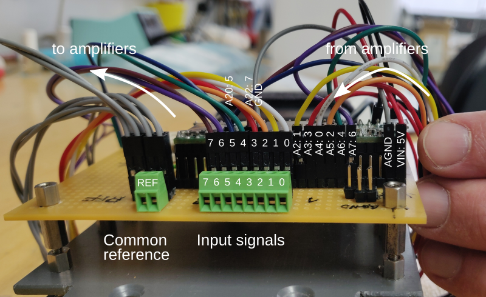
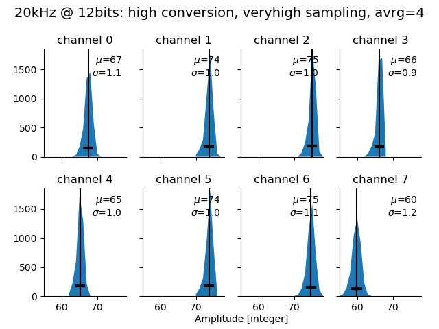

# 8-channel logger

- Four of the two-channel amplifiers by Stefan Mucha ([TeensyAmp
  R1.0](https://github.com/muchaste/Teensy_Amp/tree/main/R1.0)) are
  connected to a [Teensy 3.5](https://www.pjrc.com/store/teensy35.html).

- Water temperature is logged from a [DS18B20 1-wire digital
  thermometer](https://datasheets.maximintegrated.com/en/ds/DS18B20.pdf).

Designed by Jan Benda in November 2021.

The four amplifiers are mounted on the bottom side of the base plate:

The amplifier to the left for channels 0 and 1 gets the 5V from the
power bank (red and black cables coming in from the top). This is
forwarded to the next amplifier together with the 1.6V ground (grey
cable) that is only produced by the first amplifier.

In the image, the high-pass filter is set to 100Hz (yellow jumpers at
the bottom), the gain to 30x (middle position of the switch), and the
low pass filter to 7kHz (left position of the switch).

On the upper side we have the Teensy, the power bank, an on-off
switch, and the screw terminals for the 8 inputs and their reference:

## Usage

For setting up and operating the logger software, see [usage](usage.md).

## Wiring

Viewed from the left we see the screw terminals for the input signals
and how the amplified signals are connected to the Teensy:

Input and output signals are color coded:

- channel 0: white
- channel 1: yellow
- channel 2: orange
- channel 3: red
- channel 4: green
- channel 5: blue
- channel 6: purple
- channel 7: brown

The 8 amplified signals from the amplifiers are connected as follows
to the Teensy:
- channel 0: A4  (ADC0)
- channel 1: A2  (ADC1)
- channel 2: A5  (ADC0)
- channel 3: A3  (ADC1)
- channel 4: A6  (ADC0)
- channel 5: A20 (ADC1)
- channel 6: A7  (ADC0)
- channel 7: A22 (ADC1)

Here is the [Teensy 3.5
pinout](https://www.pjrc.com/teensy/pinout.html#Teensy_3.5):

JP3 pin 4 (0V) of the amplifiers is *not* connected to AGND or GND of
the Teensy.

On Teensy, connecting AGND (Ananlog GND) to GND seems to reduce noise
a tiny bit.

## Noise levels

Running with 20 kHz at 12 bit resolution, the [averaging
sketch](https://github.com/janscience/TeeRec/blob/main/examples/averaging/averaging.ino)
of the [TeeRec](https://github.com/janscience/TeeRec) library reports
for the standard deviations of the raw integer readings:

| convers  | sampling | avrg |   A4 |   A2 |   A5 |   A3 |   A6 |  A20 |   A7 |  A22 |
| :------- | :------- | ---: | ---: | ---: | ---: | ---: | ---: | ---: | ---: | ---: |
| veryhigh | veryhigh |    1 |  2.1 |  1.9 |  1.3 |  1.2 |  1.5 |  1.9 |  2.0 |  2.8 |
| veryhigh | veryhigh |    4 |  1.7 |  1.5 |  1.7 |  1.1 |  1.5 |  1.1 |  1.7 |  1.5 |
| veryhigh | veryhigh |    8 |  2.4 |  1.1 |  2.4 |  1.1 |  1.4 |  1.4 |  1.4 |  1.6 |
| veryhigh | veryhigh |   16 |  1.4 |  0.9 |  0.8 |  0.9 |  1.2 |  0.8 |  1.1 |  0.9 |
| veryhigh | high     |    1 |  2.4 |  2.1 |  1.5 |  1.3 |  1.7 |  1.9 |  2.4 |  2.9 |
| veryhigh | high     |    4 |  1.8 |  1.7 |  1.5 |  1.6 |  1.7 |  1.6 |  1.4 |  1.7 |
| veryhigh | high     |    8 |  1.8 |  2.0 |  1.5 |  1.7 |  2.3 |  2.4 |  1.8 |  1.9 |
| veryhigh | med      |    1 |  2.4 |  1.9 |  1.5 |  1.3 |  1.6 |  1.7 |  2.5 |  3.2 |
| veryhigh | med      |    4 |  1.2 |  1.2 |  1.2 |  1.2 |  1.2 |  1.2 |  1.2 |  1.5 |
| veryhigh | med      |    8 |  2.6 |  2.4 |  3.0 |  2.4 |  2.0 |  2.3 |  2.1 |  2.4 |
| high     | veryhigh |    1 |  2.6 |  2.1 |  1.4 |  1.3 |  1.6 |  1.9 |  2.6 |  3.3 |
| high     | veryhigh |    4 |  2.9 |  2.9 |  2.8 |  3.0 |  2.9 |  3.0 |  2.9 |  3.0 |
| high     | veryhigh |    8 |  1.1 |  0.9 |  0.8 |  0.8 |  0.9 |  0.9 |  0.9 |  1.0 |
| high     | high     |    1 |  3.7 |  3.8 |  2.7 |  2.7 |  2.8 |  3.3 |  3.8 |  5.1 |
| high     | high     |    4 |  1.2 |  1.2 |  1.0 |  1.0 |  1.1 |  1.2 |  1.3 |  1.7 |
| high     | med      |    1 |  3.9 |  3.7 |  2.8 |  2.8 |  3.0 |  3.3 |  4.0 |  4.6 |
| high     | med      |    4 |  1.4 |  1.3 |  1.1 |  1.1 |  1.1 |  1.3 |  1.5 |  1.8 |
| med      | veryhigh |    1 |  4.0 |  3.7 |  3.0 |  2.9 |  3.2 |  3.4 |  4.1 |  4.7 |
| med      | veryhigh |    4 |  1.6 |  1.4 |  1.1 |  1.2 |  1.2 |  1.3 |  1.8 |  1.7 |
| med      | high     |    1 |  3.0 |  3.0 |  1.6 |  1.5 |  1.8 |  2.4 |  3.1 |  4.4 |
| med      | high     |    4 |  2.1 |  2.1 |  1.1 |  1.1 |  1.2 |  1.6 |  2.1 |  2.8 |
| med      | med      |    1 |  3.4 |  2.8 |  1.7 |  1.5 |  2.2 |  2.4 |  3.6 |  4.0 |

Amplifiers were connected wit their inputs short-circuited (IN+
connected to IN-). Recordings are stored in
[`tests/averaging`](tests/averaging).

A good setting (traces plotted with [`viewwave.py`](https://github.com/janscience/TeeRec/blob/main/extras/viewwave.py), histograms with [`noise.py`](https://github.com/janscience/TeeRec/blob/main/extras/noise.py)):

A bad setting:

Running with 40 kHz at 12 bit resolution:

| convers  | sampling | avrg |   A4 |   A2 |   A5 |   A3 |   A6 |  A20 |   A7 |  A22 |
| :------- | :------- | ---: | ---: | ---: | ---: | ---: | ---: | ---: | ---: | ---: |
| veryhigh | veryhigh |    1 |  2.7 |  2.1 |  1.5 |  1.4 |  1.9 |  2.1 |  3.4 |  3.6 |
| veryhigh | veryhigh |    4 |  2.0 |  1.5 |  1.5 |  1.0 |  1.4 |  1.5 |  1.7 |  1.9 |
| veryhigh | high     |    1 |  2.2 |  2.5 |  1.4 |  1.4 |  1.6 |  2.5 |  3.1 |  3.9 |
| veryhigh | high     |    4 |  1.6 |  1.5 |  2.0 |  2.5 |  1.7 |  1.0 |  1.3 |  1.8 |
| veryhigh | med      |    1 |  3.9 |  3.9 |  3.5 |  3.3 |  3.5 |  3.9 |  4.3 |  4.9 |
| veryhigh | med      |    4 |  1.9 |  1.2 |  2.0 |  2.1 |  1.0 |  1.4 |  1.4 |  1.8 |
| high     | veryhigh |    1 |  4.4 |  4.2 |  3.8 |  3.7 |  4.0 |  4.1 |  4.9 |  5.3 |
| high     | high     |    1 |  4.1 |  4.1 |  3.6 |  3.6 |  3.8 |  4.1 |  4.3 |  5.3 |
| high     | med      |    1 |  3.7 |  3.5 |  3.1 |  3.0 |  3.2 |  3.5 |  4.0 |  4.7 |

## Channel quality

The [averaging
sketch](https://github.com/janscience/TeeRec/blob/main/examples/averaging/averaging.ino)
results in:
- ADC0: A0-A9 are good, A14-A15 are slightly more noisy.
- ADC1: A2-A3, A20, A22 are good, A12-A13, A16-A19 slightly more noisy (by 0.1)

## ADC settings

The noise measurements suggest the following settings (alternative
settings in brackets):
- sampling rate: 20kHz (40kHz)
- resolution: 12bit
- averaging: 4
- conversion speed: high (very high)
- sampling speed: high (med)
- ADC0: A4, A5, A6, A7
- ADC1: A2, A3, A20, A22

These settings are saved in the sketch as well as in a configuration
file [teegrid.cfg](teegrid.cfg). If you copy the configuration file
onto the SD card, its settings will be loaded by the sketch and
override the ones of the sketch.

## SD Card

At 20kHz the 8 channels produce 1.2GB per hour. That makes 28GB per day.

A 128GB card should last four and a half days.

## Channel order

In files [`tests/8channels-gain*.wav`](tests) a 630Hz signal was
sequentially connected to the 8 channels. The channels are connected
in the right order!

## Polarity and gain

See the [Teensy Amp
documentation](https://github.com/muchaste/Teensy_Amp/tree/main/R1.0#gains-and-clipping)
for details on gain settings.

All channels connected to the same 630Hz sinewave signal.

Nicely amplified signals!

## High- and low-pass filter

For filter selection and test measurements see [TeensyAmp filter
section](https://github.com/muchaste/Teensy_Amp/tree/main/R1.0#filter).

- High-pass filter is set to 100Hz.
- Low-pass filter is set to 7kHz.

## Real-time clock

On-board RTC powered by separate battery.

When compiling and uploading the sketch, the real time clock is set to
the time of the host computer. This way you can easily set the
real-time clock.

You can also put a file called `settime.cfg` on the SD card. This file
should contain a single line with a date and a time in
`YYYY-MM-DDTHH:MM:SS` format. On startup, this file is read and the
time is set accordingly. The file is then removed to avoid resetting
the time on the next run of the sketch.

## Power consumption and supply

Running the system (Teensy with 20kHz ADC on 8 channels with four
amplifiers) results in:

| Voltage | Current | Power | Runtime |
| ------: | ------: | ----: | ------: |
| 5V      | 133mA   | 664mW | 46h     |
| 3.3V    | 111mA   | 366mW | -       |

The last colum is the run time to be expected for a 10Ah battery (10Ah
times 3.7V LiPo voltage divided by 5.1V output voltage times 85%
efficiancy (=0.62) divided by current).

The system, i.e. the Teensy and the four amplifiers, is powered with a
[10000mAh power
bank](https://www.conrad.de/de/p/realpower-pb-10000-powerbank-zusatzakku-lipo-10000-mah-270315-2304822.html)
providing a voltage of 5.04V.

| Run  | Time     |
| ---: | -------: |
| 1    | 39h20min |
| 2    | 38h40min |

The first two runs did this power bank power the system about one and
a half day. This is 6h (=15%) less of what is expected from the
capacity.  The manual of the power bank suggests that after a few
cycles of using and charging the power bank, its capacity gets
larger. So, hopefully it is possible to eventually run the system for
two full days.

## Temperature

Temperature is logged via an [DS18B20 1-wire digital
  thermometer](https://datasheets.maximintegrated.com/en/ds/DS18B20.pdf).

Here is how to connect the DS18B20 to the
[Teensy](https://www.pjrc.com/teensy/pinout.html#Teensy_3.5):

- black wire: GND (left most pin on the Teensy)
- red wire: 3.3V (between pin 12 and 14 on the Teensy)
- yellow wire: data on pin 10 (or any other digital input pin).

In addition you need to connect the data pin to 3.3V via a 4.7kΩ
pullup resistance.  See [here](
https://create.arduino.cc/projecthub/TheGadgetBoy/ds18b20-digital-temperature-sensor-and-arduino-9cc806)
for a circuit diagram.