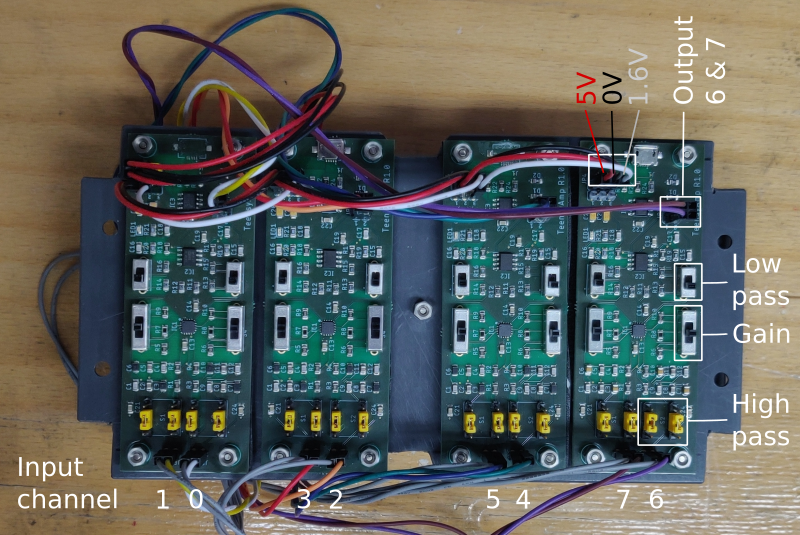

# TeeGrid

Record electric fish with electrode arrays based on
[Teensy](https://www.pjrc.com/teensy/) microcontrollers.

Based on the [TeeRec](https://github.com/janscience/TeeRec) library,
inspired by Stefan Mucha's
[EOD-Logger](https://github.com/muchaste/EOD-Logger), the
[ESensors](https://github.com/janscience/ESensors) library, abd the
[Teensy_Amp](https://github.com/janscience/Teensy_Amp) amplifiers.

## R4 logger with sensors

Logger for 2 to 16 channels based on
[Teensy_Amp R4.1](https://github.com/janscience/Teensy_Amp/tree/main/R4.1) or
[Teensy_Amp R4.2](https://github.com/janscience/Teensy_Amp/tree/main/R4.2) with additional environmental sensors. [Read more](examples/R4-sensors-logger/).

## R4 logger

Logger for 2 to 16 channels based on
[Teensy_Amp R4.1](https://github.com/janscience/Teensy_Amp/tree/main/R4.1) or
[Teensy_Amp R4.2](https://github.com/janscience/Teensy_Amp/tree/main/R4.2). [Read
more](examples/R4-logger/).

## R40 logger

Logger for 2 to 8 channels based on [Teensy_Amp
  R4.0](https://github.com/janscience/Teensy_Amp/tree/main/R4.0). [Read
  more](examples/R40-logger/).

## 8-channel logger

Logger for 8 channels based on [Teensy_Amp
  R1.0](https://github.com/muchaste/Teensy_Amp/tree/main/R1.0).  [Read
  more](examples/8channel-logger/).

## 8-channel logger with sensors

A variant of the [8-channel logger](8channel-logger/) that
supports a variety of environmental sensors. [Read
more](examples/8channel-sensors-logger/).

## SdFormatter

The SDFat SDFormatter sketch without the interaction on the Serial
console.  [Read more](examples/SdFormatter/)

## Housings

- [PVC-tube housings](doc/pvc-tube-housing)

## Electrodes

- [Stainless-steel electrodes](doc/steel-electrodes)

## Installation

- [Installation instructions](doc/installation) for the TeeGrid
  library and sketches.

## Resources

Ideas to solve the syncrhonization problem of multiple loggers:

- [Low-cost synchronization of high-speed audio and video recordings
  in bio-acoustic experiments](https://doi.org/10.1242/jeb.173724)
- [Bio-acoustic tracking and localization using heterogeneous,
  scalable microphone
  arrays](https://doi.org/10.1038/s42003-021-02746-2)
