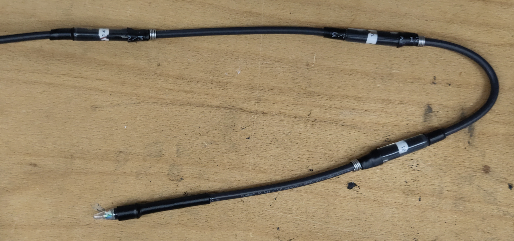

# Stainless-steel wire electrodes

A cable with 16 stainless-steel-wire electrodes - shown are the three electrodes and the end-cap:

Close up of the electrode with the stainless-steel electrode to the
right and the waterproof epoxy-shrinking tube construction for the
wire outlet:

## Material

- 16 wire cable: [kabeltronik UL-LiYCY 16 x AWG 26](https://www.kabeltronik.de/de/electronics-industry/contol-cables-acc-to-ul/art/ul-cul-control-cable-shielded-ul-liycy-style-2464-1061-16/)

## International Color code

| core | color        |
| ---: | :----------- |
|  1   | black        |
|  2   | brown        |
|  3   | red          |
|  4   | orange       |
|  5   | yellow       |
|  6   | green        |
|  7   | blue         |
|  8   | purple       |
|  9   | grey         |
| 10   | white        |
| 11   | white-black  |
| 12   | white-brown  |
| 13   | white-red    |
| 14   | white-orange |
| 15   | white-yellow |
| 16   | white-green  |