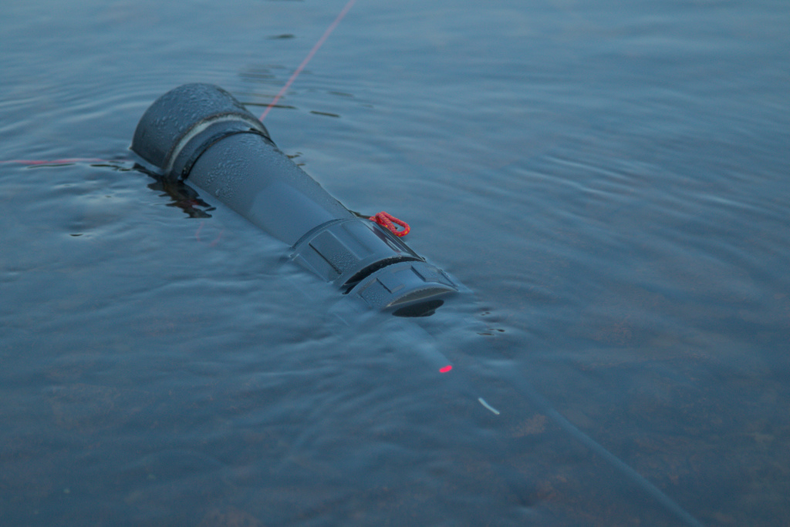
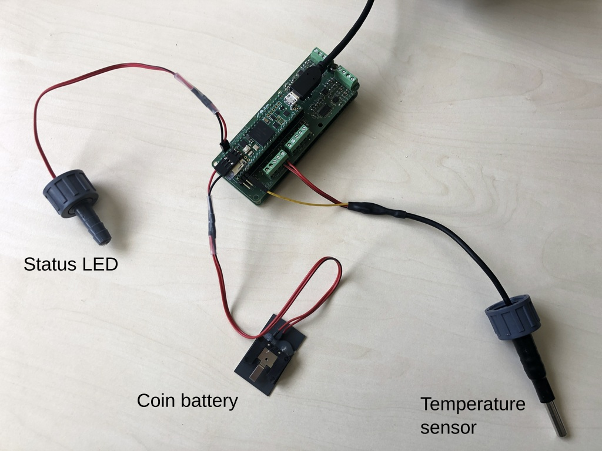
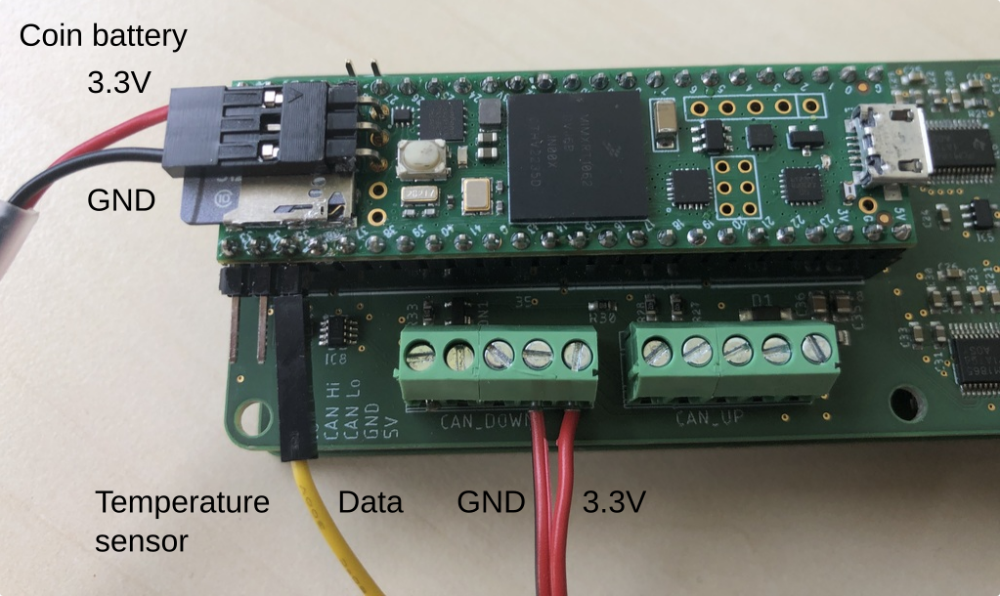

# R4.x sensors logger

Logger for 2 to 16 channels based on [Teensy_Amp R4.1](https://github.com/janscience/Teensy_Amp/tree/main/R4.1) and/or [R4.2](https://github.com/janscience/Teensy_Amp/tree/main/R4.2)
  connected to a [Teensy 4.1](https://www.pjrc.com/store/teensy41.html) with additional sensors.

Designed by Jan Benda and Patrick Weygoldt in September 2023.





## Assembly

Connect the wires from the [electrodes](../../doc/steel-electrodes) to the screw terminals of the amplifier...


... using this [color code](https://github.com/janscience/TeeGrid/tree/main/doc/steel-electrodes#international-color-code)

Connect the coin battery and the temperature sensor:





- Status LED: plug onto the two pins on the
  [R4.1](https://github.com/janscience/Teensy_Amp/tree/main/R4.1) PCB
  top left corner. When running the
  [`R4-sensors-logger.ino`](R4-sensors-logger.ino) sketch, and this
  LED does not light up, then unplug, turn by 180 degrees, and plug in
  again.

- Coin battery: make sure the +3.3V (hopefully red) is on the side,
  and ground (hopefully black) is in the center of the Teensy. Better
  is to check the polarity of the coin battery using a multimeter.

- Temperature sensor: the data wire goes on third pin (counted from
  the SD card end of the Teensy, pin 35). Power is the red cable,
  ground is the red cable with the black line on the outside.


## Installation

See the [installation instructions](../../doc/install.md) for the
TeeGrid library.


## Software setup

The behavior of the logger sketch can be modfied in various
ways. Either by editing some variables directly in the sketch, as
described here, or by a configuration file provided on the SD card, as
described in the next section.

*WARNING* the settings of the config file overwrite the settings made
 in the sketch!

For editing the sketch, open the
[`R4-sensors-logger.ino`](R4-sensors-logger.ino) sketch in the Arduino
IDE (`File` - `Open`, `Ctrl-O`, or `File` - `Examples` - `TeeGrid` -
`R4-senosrs-logger`) and edit it appropriately.  In the top section
marked as `Default settings` you may adapt some settings according to
your needs as described in the next sections.

Once you modified the sketch to your needs, compile and upload it to
the Teensy (`Ctrl-U`). Open the serial monitor (`Ctrl-Shift-M`) and
check the output of the sketch.


### Data acquisition

The first section is about the data acquisition:

- `NCHANNELS`: the number of channels you want to record. If you use a
  single [Teensy_Amp R4.1](https://github.com/janscience/Teensy_Amp/tree/main/R4.1)
  or [R4.2](https://github.com/janscience/Teensy_Amp/tree/main/R4.2) then set this to 8.
  If you use [both of them stacked
  together](https://github.com/janscience/Teensy_Amp/tree/main/R4.1-R4.2),
  then set it to 16.
- `SAMPLING_RATE`: the sampling rate you want to use (48000 or 96000 Hertz).
- `PREGAIN`: the gain of the preamplifier, either 10 (default) or 1
  (for recording electric eels). *Make sure this is is set to the right number!*
- `GAIN`: additional gain of the ADC in dB. 0: x1, 20: x10, 40: x100.

For wavefish use an amplifier with a pregain of 10 and set the gain
to 20dB. For electric eels, use an amplifier with a pregain of 1 and
set the gain to 0dB.


### File naming and size

The second section is about the files that store the data on the SD
card.

- `PATH`: name of the directory, in which the files are stored.
- `FILENAME`: name of the files that store the recorded data. See
  below for special strings to insert data and time.
- `FILE_SAVE_TIME`: each file will store that many seconds of the
  continuous recording.
- `INITIAL_DELAY`: after startup, wait for the specified time in
  seconds before writing data to files.


#### Special strings for the file name

The following special strings in the file name are replaced by
the current date, time, or a number:

- `DATE`: the current date as ISO string (YYYY-MM-DD)
- `SDATE`: "short date" - the current date as YYYYMMDD
- `TIME`: the current time as ISO string but with dashes instead of colons (HH-MM-SS)
- `STIME`: "short time" - the current time as HHMMSS
- `DATETIME`: the current date and time as YYYY-MM-DDTHH-MM-SS
- `SDATETIME`: "short data and time" - the current date and time as YYYYMMDDTHHMMSS
- `ANUM`: a two character string numbering the files: 'aa', 'ab', 'ac', ..., 'ba', 'bb', ...
- `NUM`: a two character string numbering the files: '01', '02', '03', ..., '10', '11', ...
- `NUM3`: a three character string numbering the files: '001', '002', '003', ..., '010', '011', ..., '100', '101', ...
- `NUM4`: a four character string numbering the files: '0001', '0002', '0003', ..., '0010', '0011', ..., '0100', '0101', ..., '1000', '1001', ...


### Pins and Sensors

- `LED_PIN`: the [Teensy pin](https://github.com/janscience/Teensy_Amp/blob/main/R4.1/images/teensy41-R41-pinout.png) to which the LED on the amplifier is connected to.
- `TEMP_PIN`: the [Teensy pin](https://github.com/janscience/Teensy_Amp/blob/main/R4.1/images/teensy41-R41-pinout.png) to which the DATA wire of the [Dallas
  DS18x20](https://github.com/janscience/ESensors/blob/main/docs/chips/ds18x20.md)
  temperature sensor is connected to.
- `SENSORS_INTERVAL`: interval between sensor readings in seconds


## Configuration file

Most of the settings described above can be configured via a
configuration file. Simply place a configuration file named
[`logger.cfg`](logger.cfg) into the root folder of the SD card. If
present, this file is read once on startup. The configuration file
will overwrite the settings made in the
[`R4-sensors-logger.ino`](R4-sensors-logger.ino) sketch.

The content of the configuration file should look like this:

```txt
Settings:
  Path:            recordings
  FileName:        logger1-SDATETIME.wav
  FileTime:        5min
  InitialDelay:    10s
  SensorsInterval: 10.0s
ADC:
  SamplingRate: 48.0kHz
  NChannels:    16
  Gain:         20.0dB
``` 

Everything behind '#' is a comment. All lines without a colon are
ignored.  Unknown keys are ignored but reported. Times and frequencies
understand various units (s, min, h, kHz, MHz). Check the serial
monitor of the Arduino IDE (`Ctrl+Shif+M`) to confirm the settings.


## Real-time clock

For proper naming of files, the real-time clock needs to be set to the
right time. The easiest way to achieve this, is to compile and upload
the [`R4-sensors-logger.ino`](R4-sensors-logger.ino) sketch from the
Arduino IDE. The upload also sets the on-bard real-time clock to the
time of the computer. Use the serial monitor to check the output of
the sketch. At the beginning it reports the time. Disconnect the
Teensy from the USB and simply reconnect it. If it then reports on the
serial monitor the right time, the real time clock is properly set and
is properly powered by the coin battery.

Alternatively, you may copy a file named `settime.cfg` into the root
folder of the SD card. This file contains a single line with a date
and a time in the following format:
``` txt
YYYY-MM-DDTHH:MM:SS
```

In a shell you might generate this file via
```sh
date +%FT%T > settime.cfg
```
and then edit this file to some time in the near future.

Insert the SD card into the Teensy. Start the Teensy exactly at the
time that is written into the `settime.cfg` file by connecting it to
power. On start up the
[`R4-sensors-logger.ino`](R4-sensors-logger.ino) sketch reads in the
`settime.cfg` file, sets the real-time clock to this time, and then
deletes the file from the SD card to avoid resetting the time at the
next start up.


## Check logger function

Run the logger from the Arduino IDE and check the output on the serial
monitor (`Ctrl+Shif+M`). You should then see something like the
following. The comments after `#` have been inserted afterwards to
explain what is important:

```txt
=======================================================================

RTC (on-board) current time: 2024-07-23T10:24:08      # this should be the current time and not 2019-01-01T00:00:00

Configuration file "logger.cfg" not found or empty.   # if you use a configuration file, it should be reported here

Settings:                                             # check whether these configuration settings are right
  Path:            recordings
  FileName:        logger1-SDATETIME.wav
  FileTime:        300s
  PulseFreq:       0Hz
  InitialDelay:    10s
  SensorsInterval: 10.0s
ADC:
  SamplingRate: 48.0kHz
  NChannels:    16
  Gain:         0.0dB
  
1 of 1 environmental sensor available, read every 10s:  # check whether the temperature sensor is detected
  water-temperature T_water (ºC):	 on DS18B20 device (ID: 28 43 AA 67 B2 23 06 10) at a resolution of 0.06ºC.
  
Setup PCM186x 0 on TDM 0: configured for 4 channels  # make sure all 4 chips are detected and configured for 4 channels
Setup PCM186x 1 on TDM 0: configured for 4 channels
Setup PCM186x 2 on TDM 1: configured for 4 channels
Setup PCM186x 3 on TDM 1: configured for 4 channels

TDM settings:                                        # check the sampling rate
  rate:       48.0kHz
  resolution: 32bits
  channels:   16
  swap l/r:   1
  buffer:     2.73s (2097152 samples)
  DMA time:   1.3ms

Save recorded data in folder "recordings".

logger1-2024-07-23T10:24:21.wav                     # this is the first file in which recorded data are stored

Timestamp = 2019-01-01T00:00:14
water-temperature = 26.25ºC                         # this is the measured temperature
```


## Logging

1. *Format the SD card.* (see section below)
2. Optional: Copy your logger.cfg file onto the SD card.
3. Insert the SD card into the Teensy.
4. Connect the Teensy to a battery/power bank.
5. Close the housing.
6. Place the logger whereever you want to record electric fishes.
7. Let the logger record the data.
8. Check the status LED whether it blinks every 5 secods. If it is not
   blinking, then something is wrong.
9. After many hours (or days, depending on the capacity of your powerbanks),
   collect the logger.
10. Open it, and disconnect the Teensy from the powerbank.
11. Optionally repeat 4. - 10. with a freshly charged powerbank
    until the SD card is full.
12. Take out the SD card and store the data on a harddrive.
    Don't forget to backup the data.


### Formatting the SD card

The SD card needs to be reformatted once in a while. The logger runs
until the battery is drained and therefore cannot properly close the
last files. This leaves the file system in a corrupted state, which
apparently results in very long delays when writing to the SD card
again.

You may use the sketch provided by the SdFat library for formatting
the SD card directly on a Teensy: In the Arduino IDE menu select
`File` - `Examples`, browse to the last section ("Examples from custom
libraries"), select `SdFat` and then `SdFormatter`. Upload the script
on Teensy and open the serial monitor. Follow the instructions on the
serial monitor.

Or use the `SdFormatter` script provided in TeeGrid. This is the same
script as the one described above, but without user interaction. When
running it will erase and format the SD card inserted into the Teensy.
You find this script under `File` - `Examples` - `TeeGrid` -
`SdFormatter`.

Formatting from a computer also helps, but this omits the erasing
part.


### Status LED

The on-board LED of the Teensy and the LED of the [Teensy_Amp
R4.1](https://github.com/janscience/Teensy_Amp/tree/main/R4.1) or
[R4.2](https://github.com/janscience/Teensy_Amp/tree/main/R4.2)
indicate the following events:

- On startup the LED is switched on during the initialization of the
  data acqusition and SD card. This can last for up to 2 seconds
  (timeout for establishing a serial connection with a computer).

- For the time of the initial delay (nothing is recorded to SD card)
  a double-blink every 2s is emitted.

- Normal operation, i.e. data acquisition is running and data are
  written to SD card: the LED briefly flashes every 5 seconds (file
  time larger than 30s) or every 2 seconds (file time smaller than
  30s).

- Whenever a file is closed and the next one opened, the LED lights for
  1 second. Then it continues with flashes every 5 seconds.

- The LED is switched off if no data can be written on the SD card (no
  SD card present or SD card full) or data acquisition is not working.
  In this case, connect the Teensy to a computer and open the serial
  monitor of the Arduino IDE (`Ctrl+Shif+M`). On startup the settings
  for the data acquisition are reported and in case of problems an
  error message is displayed.


## Files

Analog input data are stored on the SD card as wave files in the
directory specified by `PATH` with names `FILENAME`. The metadata
in these files indicate the time when the file was created and the
overall gain of the hardware.

You may use the Python
[audioio](https://github.com/janscience/audioio) package to read the
recorded channels and the metadata. Or use the
[DataLoader](https://github.com/bendalab/thunderlab/blob/main/src/thunderlab/dataloader.py)
from the [thunderlab](https://github.com/bendalab/thunderlab)
package. The latter applies the gain setings directly to the data.

For viewing the data, you may use any audio tool. Or check out
[audian](https://github.com/bendalab/audian).

The sensor data are stored as a csv file with the very same name as
the first data file, but with `-sensors.csv` added to it.


## Improvements

- Add sensor for illumination and water conductivity. Make a PCB for this!
